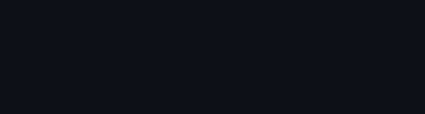

# FertigungsAI - Multimodal AI Quality Control Inspector

## Problem Statement
Germany manufacturing loses €50B/year to defects.
40% of SMEs cannot find AI-qualified workers (BMBF 2024).
This project demonstrates how a student can build a production-grade multimodal AI for this market using entirely free tools.

## Architecture Diagram

```ascii
Image Upload → FastAPI → YOLOv8n → LangGraph →
[Hybrid RAG: ChromaDB + BM25 + RRF] →
[Cross-Encoder Reranker] →
[Groq LLaMA-3.3-70B] → SSE Stream → React Frontend

Camera / gateway → MQTT (Mosquitto, QoS 1) → bridge → Redis Stream (consumer group) → worker(s): YOLOv8n → SQLite log + Prometheus
                                                                                          ├→ TimescaleDB hypertable (per-frame metrics)
                                                                                          └→ StreamMonitor: drift / fault / stall alerts → log, DB, webhook
```

## Tech Choices Explained
- **Groq API (llama-3.3-70b-versatile):** Selected for its incredible speed and free tier allowing 500K tokens/day without a credit card.
- **YOLOv8n (CPU-only):** Nano version is extremely lightweight, providing fast object detection (~200ms) on HuggingFace's free CPU tier.
- **sentence-transformers/all-MiniLM-L6-v2:** High-quality local embeddings, ensuring GDPR safety by not sending queries to an external API.
- **cross-encoder/ms-marco-MiniLM-L-6-v2:** Used for reranking RAG results locally to improve document retrieval accuracy without extra cost.
- **ChromaDB & rank-bm25:** Used for the Vector Database and Sparse RAG, giving a powerful hybrid search without needing a cloud database subscription.
- **HuggingFace Spaces & Vercel:** Best-in-class free hosting for Docker/FastAPI backends and React frontends.

## MLOps Practices Explained
- **Prometheus counters/histograms/gauges:** inspections by machine, defect type and severity; vision and end-to-end latency; stream frames by outcome, queue delay and lag; defect rate per machine; alert events. The stream worker serves its own `/metrics` on port 9108. Earlier versions defined the latency histograms and the defect-rate gauge but never updated them; they are wired now.
- **Dashboard numbers come from the log:** inspected today, defect rate, last-hour throughput, hourly frames and defects, defect mix, p50/p95 inference latency and the alerts are all computed from logged rows. Earlier versions showed fixed RAGAS scores (0.92/0.88/0.95), a fixed OEE of 89.5%, a fixed 142 inspections/hour and a formula-generated hourly chart; those were constants, not measurements, and were removed. RAGAS and OEE appear on the dashboard under "Not measured", with the reason.
- **RAGAS Integration:** ~~Asynchronous evaluation of the RAG pipeline assessing faithfulness, answer relevancy, and context precision.~~ **Correction:** `backend/mlops/evaluation.py` is currently an empty placeholder (`pass`, with a "Placeholder for RAGAS evaluation" comment); RAG answers are not scored automatically. See "Evaluation" below for what actually is measured.
- **Structured Logging:** `structlog` for predictable, parsable application logs.

## Streaming and monitoring

Frames from a camera are published to a **Redis Stream**; one or more workers share them through a consumer group, run the fine-tuned detector, log every frame, and feed a **monitor** that raises alerts. Only vision runs per frame; the LLM root-cause agent stays on the on-demand `/inspect` path (too slow and costly per frame).

- **Delivery:** at-least-once. A frame is acknowledged only after it is processed and logged; a worker that crashes leaves its frames pending, and another worker takes them over (`XAUTOCLAIM`). Re-delivered frames are logged once (idempotent insert) and are not counted twice by the monitor. An undecodable image is dead-lettered and acknowledged so one bad frame cannot block the stream. The stream is capped, so if workers fall behind the oldest frames are dropped instead of memory growing.
- **Monitor:** the first 150 frames are the baseline (they must come from a healthy line), then the last 100 frames are checked every 10: a Fisher exact test on the share of frames with a detection (up = defect surge, down = blind camera or dirty lens), a chi-square test on the defect-class mix, Kolmogorov-Smirnov tests on image brightness, contrast, sharpness and detection confidence, a latency limit (2x the baseline p95), and a stall check. An alert fires after two consecutive breaches, is not repeated while firing, and resolves after two clean checks. Alerts go to the log, the `alerts` table (`GET /api/mlops/alerts`), and an optional Slack-compatible webhook (`ALERT_WEBHOOK_URL`).
- **MQTT at the edge:** cameras and gateways publish to `factory/<line>/<machine>/frames` (QoS 1) on a Mosquitto broker, the protocol factory equipment speaks; `streaming/mqtt_bridge.py` forwards each frame onto the Redis stream, re-subscribes after a broker restart and drops (and counts) malformed messages instead of stopping. Redis Streams stay on the plant side for consumer groups, acknowledgement and reclaim.
- **TimescaleDB:** the worker also writes every frame's metrics to a hypertable (`frame_metrics`) with a unique index so a redelivered frame is stored once, a continuous aggregate (`frame_metrics_1m`, per-minute defects and latency per machine) and a 30-day retention policy. It is optional (`TIMESCALE_URL`), and an outage of the time-series store never blocks inspection (the failure is counted, the frame is still acknowledged). SQLite stays the system of record for inspections and alerts.
- **API:** `GET /api/stream/status` (lag, frames processed, open alerts), `GET /api/mlops/alerts`, `GET /api/mlops/metrics`, `GET /api/mlops/timeseries?machine=M1&minutes=60&bucket=1 minute` (defect rate and p95 latency per bucket from TimescaleDB).

```bash
# worker + Redis (compose profile "stream"); set REDIS_URL=redis://redis:6379/0 in .env for /api/stream/status
docker compose --profile stream up -d
# simulated camera: replays test images over MQTT and blurs the lens from frame 450 on
NEUDET_TEST_IMAGES=/path/to/NEU-DET/test/images docker compose --profile stream --profile demo up producer
```

## Kubernetes (`deploy/k8s`)

The whole streaming stack as Kustomize manifests: Redis, Mosquitto, a TimescaleDB StatefulSet with a volume claim, the API (HorizontalPodAutoscaler, startup/readiness/liveness probes), the stream worker, the MQTT bridge, five NetworkPolicies (default deny, then only the paths the pipeline uses) and resource requests and limits on everything.

```bash
kubectl create namespace inspectai
kubectl -n inspectai create secret generic timescaledb-credentials --from-literal=password="$(openssl rand -hex 16)"
kubectl apply -k deploy/k8s/base          # needs an image named inspectai:latest that the cluster can pull
```

**Tested on every push** (the `kubernetes` CI job): a throwaway `kind` cluster, `kubectl apply --dry-run=server` of every manifest, the real image built and loaded, all workloads rolled out, then a camera Job publishes 40 frames over MQTT and the job asserts they arrive in TimescaleDB through the bridge, Redis Stream and the YOLO worker, with the stream lag back at 0. That proves the manifests deploy and the pipeline works inside a cluster; it does not prove production readiness.

Known limits, stated plainly: the API and the worker share a SQLite file on a ReadWriteOnce volume, so the worker has a pod affinity to the API's node and runs as a single replica (a shared database such as the TimescaleDB would remove this); Mosquitto allows anonymous clients inside the namespace and needs authentication and TLS in production; the app image runs as root; the HorizontalPodAutoscaler needs metrics-server, which kind does not ship; there is no Ingress, the frontend is a static site hosted separately.

### Measured on real detector output (`docs/monitoring_eval.md`)

The real fine-tuned YOLOv8n ran over 90 held-out NEU-DET test images, clean and with camera faults; streams of 900 frames (baseline of 150, a fault from frame 450) were replayed through the real monitor, 200 random streams per scenario. The 180 test images were split: the even half was used to diagnose and fix the monitor, this table is on the odd half, which that work never touched.

| Scenario | Detected within 150 frames | Median delay | Healthy-segment false alarm |
|---|---|---|---|
| no change | n/a | n/a | 1 of 200 runs (0.5%) |
| blurred lens | 200 / 200 | 40 frames | 0 of 200 |
| lights drop to 50% | 200 / 200 | 50 frames | 0 of 200 |
| sensor noise | 200 / 200 | 40 frames | 0 of 200 |
| defect mix shifts to 80% scratches | 200 / 200 | 60 frames | 0 of 200 |
| inference 3x slower (**simulated**) | 200 / 200 | 20 frames | 0 of 200 |

At 10 frames per second, 40 frames is 4 seconds. The real `Worker` (decode, YOLO, SQLite, monitor) processed between 38 and 84 frames/s on a laptop RTX 4050 across four runs; that is one process on in-memory transport, not a Redis benchmark.

**What went wrong first, kept in the report:** the first version false-alarmed in 15% of healthy runs (5.8% of fault-free segments overall) because the defect-rate control chart (mean +/- 3.5 sigma) is wrong when the hit rate is about 97%: the count of missed frames is skewed and the normal limits are too tight. Replacing it with an exact test fixed it (0 of 300 healthy runs on the diagnosis half). The significance levels were not changed.

**Limits:** 90 distinct images re-sampled with replacement and step changes are easier than real drift; every NEU-DET image contains a defect, so a defect surge is not tested, only faults that change what the detector sees; the baseline must come from a healthy line; the latency scenario is simulated; and a rate like 0.5% from 200 runs is imprecise.

## Defect detector: fine-tuned on real data (updated, was a known gap)

`backend/vision/detector.py` used to run stock YOLOv8n, pretrained on COCO, with COCO classes remapped onto invented defect labels via `cls_id % 6`, plus a hash-based simulated fallback when nothing was detected. That's fixed for real now: YOLOv8n is fine-tuned on **NEU-DET**, a public steel surface defect dataset (1800 images, 6 real classes with bounding-box labels), full method and honest per-class numbers in [`finetune/README.md`](finetune/README.md).

Measured on a 180-image held-out test split: **mAP50 0.750** (up from 0.0 for the untouched stock model, which has no overlap with these classes by construction). Per-class AP50 ranges from 0.945 (patches) down to 0.449 (crazing), the weak class is disclosed, not averaged away. The simulated fallback is gone, an empty result now means the model genuinely found nothing.

## Demo

Terminal recording of the real RAG retrieval evaluation running end to end:



## Evaluation: RAG retrieval (real, local, $0)

Unlike the vision side, the RAG components (`rag/embeddings.py` LocalEmbeddings, `rag/retriever.py` BM25Index, `rag/reranker.py` CrossEncoderReranker) are genuinely real and run entirely locally via sentence-transformers — no external API, no cost. `tests/eval_retrieval.py` measures BM25 vs. local dense embedding retrieval against 20 hand-labeled manufacturing-QC queries over a 20-passage corpus, using the real, unmodified `BM25Index` and `LocalEmbeddings` classes:

```
BM25            Recall@1=100.0%  Recall@3=100.0%
Dense (local)   Recall@1=100.0%  Recall@3=100.0%
```

Both methods hit 100% on this set — worth being honest about what that does and doesn't prove: the 20 QC passages are topically distinct enough (each query has essentially one clearly-correct match) that this particular eval doesn't stress-test the difference between BM25 and dense retrieval the way RAGForge's comparable eval did (where Hybrid actually underperformed Dense). A harder eval with near-duplicate or ambiguous passages would be needed to meaningfully separate the two methods here; this run confirms both retrieval paths work correctly end-to-end, not that they're equally good under pressure.

## Quick Start
1. Clone the repository:
   ```bash
   git clone https://github.com/YOUR-USERNAME/fertigungsai.git
   cd fertigungsai
   ```
2. Copy environment file and add your Groq API key:
   ```bash
   cp .env.example .env
   nano .env
   ```
3. Run the complete stack via Docker Compose:
   ```bash
   docker-compose up --build
   ```

## Free Deployment Guide Step by Step
1. **Backend (HuggingFace Spaces):**
   - Create a new Space on HuggingFace and select "Docker" as the SDK.
   - Set the `GROQ_API_KEY` in the space settings.
   - Push the contents of the `fertigungsai` repository to the Space.
2. **Frontend (Vercel):**
   - Import the `frontend` folder to a new Vercel project.
   - Set the `VITE_API_URL` environment variable to your HuggingFace Space URL.
   - Deploy.
3. **CI/CD:**
   - Configure your GitHub repository secrets: `GROQ_API_KEY`, `HF_TOKEN`, `HF_USERNAME`, `VERCEL_TOKEN`.

## Known limitations
- `estimated_savings_eur` in the `/inspect` response is written by the LLM, which is shown an example value (5000) in its prompt; it is not computed from any cost model. Treat it as illustrative.
- The RAG retrieval evaluation above is saturated (both methods 100%), so it does not separate BM25 from dense retrieval.
- Alerts are persisted in SQLite and read by the API; for several API replicas a shared database would be needed (the API and one worker share the file through a Docker volume).
- Redis Streams here are a single-node, unauthenticated broker for local use; production needs authentication, TLS and persistence settings chosen for the line.

## Cost Breakdown: €0.00/month
- LLM Inference: €0 (Groq)
- Vision Inference: €0 (Local YOLOv8n)
- Vector DB: €0 (Local ChromaDB)
- Backend Hosting: €0 (HuggingFace Spaces)
- Frontend Hosting: €0 (Vercel)
- CI/CD: €0 (GitHub Actions)

## EU AI Act Compliance Note
This system falls under **Minimal Risk (Article 6)**. It acts as an internal quality control system and does not interact with consumers, manipulate human behavior, or make safety-critical decisions autonomously.

## Test coverage

82 tests in CI (against real Redis, Mosquitto and TimescaleDB services; 73 run with no service at all), **94% line coverage** (91% without the services) of the backend source packages `monitoring`, `streaming`, `mlops` and `api` (CI fails below 85%); the frontend has its own test job. The YOLO inference and LLM-agent modules are covered by integration-style tests and are not part of that percentage.

**Verified end to end** (locally, real Mosquitto, Redis, TimescaleDB and the real fine-tuned YOLO): 120 frames published over MQTT arrived in SQLite (120 rows) and in TimescaleDB (per-minute buckets with defect rate and p95 latency). CI runs the MQTT and TimescaleDB integration tests against a real Mosquitto and a TimescaleDB service container; the unit tests need neither. Mosquitto here allows anonymous access for local use only; production needs authentication and TLS.
